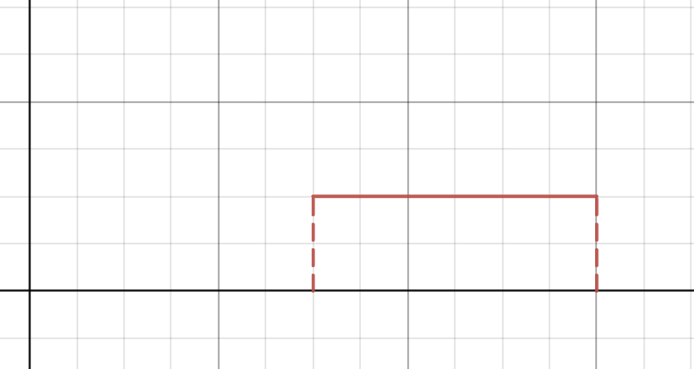

## Laplace Transforms

**Motivation.** We want to define another representation of a function, that will make solving some ODEs convenient.

The Laplace Transform is an integral transform of a function, i.e.

$$\int_\alpha^\beta{K(s,t)f(t)\text{d}t}.$$

We call $K(s,t)$ a kernel and it is specific to the transform.

**Definition.** The Laplace Transform $f$, denoted $\mathscr{L}\{f(t)\}$ or $F(s)$, is defined by $\mathscr{L}\{f(t)\} = F(s)= \int_0^\infty{e^{-st}f(t)\text{d}t}$. We assume that the integral is well-defined.

So in the context of Laplace Transforms, the kernel is an exponential function.

**Example 1.** What is the Laplace Transform of $f(t)=1$, assuming $s>0$?

We have

$$\int_0^\infty{e^{-st}\text{d}t}$$
$$=\left[\frac{-e^{-st}}{s} \right]_0^\infty$$
$$=\frac{1}{s}.$$

**Example 2.** We define the *Heaviside function*, $u(t)$, as

$$u(t)=\begin{cases}
1 \text{ if } t > 0\\
0 \text{ if } t < 0
\end{cases}$$

What is $\mathscr{L}(\{u(t-a)\})$, where $a>0$?

Then we have 

$$u(t-a)=\begin{cases}
1 \text{ if } t > a\\
0 \text{ if } t < a
\end{cases}$$

$$\mathscr{L}(\{u(t-a)\})=\int_0^\infty{e^{-st}u(t-a)}$$
$$=\int_0^a{e^{-st}\cdot 0}+\int_a^\infty{e^{-st}\cdot 1}$$
$$=\frac{e^{-sa}}{s},$$

for $s>0$.

Now we will see a table that contains common Laplace Transforms for elementary functions. (You could and should do these as an exercise. You can use integration by parts!)

**Table 1.**

|$f(t)$|$F(s)$|
|-|-|
|$c$|$\frac{c}{s}$ for $s>0$|
|$t^n$|$n!/s^{n+1}$|
|$e^{at}$|$1/s+a$|
|$\sin(wt)$|$w/(s^2+w^2)$|
|$\cos(wt)$|$s/(s^2+w^2)$|
|$u(t-a)$|$e^{-as}/s$|
|$e^{-at}f(t)$|$F(s+a)$|

**Remark.** We say that $f(t)$ is defined over a *time domain*, where $t$ is the time variable, and $F(s)$ is defined on a *frequency domain*. This makes sense when considering $s$ as an imaginary number (in this case, the kernel is a trigonometric function).

### Existence of Uniqueness of the Laplace Transform

To guarantee existence, we define the following condition:

**Definition.** A function $f$ is of *exponential order* if we can find $M,c>0$ such that when $t\rightarrow\infty$, $f(t)<Me^{ct}$.

Then (existence of uniqueness):

Let $f,g$ be $2$ piecewise continuous functions of exponential order, for a constant $c>0$.

Then their Laplace Transforms exist for all $s>c$, and if $F(s)=G(s)$ for all $s>c$, then $f(t)=g(t)$ for all $t\geq 0$.

From this, we know that we can uniquely identify a function $f(t)$ to its Laplace Transform. So our goal is now to find how to go from a Laplace Transform to the original function.

**Notation.** The inverse Laplace Transform of $F(s)$ is the function $f(t)$, such that $\mathscr{L}(\{f(t)\})=F(s)$. We will denote it $\mathscr{L}^{-1}\{F(s)\}$.

Now the two following properties/theorems are useful for finding the inverse Laplace Transform:

**1: Linearity.** 

$$\mathscr{L}(\{af(t)+g(t)\})=a\mathscr{L}(\{f\})+\mathscr{L}(\{g\})$$

and
 
$$\mathscr{L}^{-1}(\{aF(s)+G(s)\})=a\mathscr{L}^{-1}(\{F(s)\})+\mathscr{L}^{-1}(\{G(s)\})$$

**2: Shift property.**

$$\mathscr{L}(\{e^{-at}f(t)\})=F(s+a).$$

**Remark.** In general, we will try to get inverse Laplace Transforms of rational functions, which are of the form $$F(s)=\frac{P(s)}{Q(s)}.$$

We can do this by using the above two theorems to decompose $F$ into separate terms, and use partial fraction decomposition of $Q$.

So we want to find $\mathscr{L}^{-1}(F(s))$. Looking at table 1, we want to get some of the terms in that table to appear when we decompose $Q$. For example, some terms we'd like are $s+a$ and $s^2+w^2$.

**Example 3.** Find $\mathscr{L}^{-1}(F(s))$, where $F(s)=\frac{3s+4}{s^2+s-2}$.

We cannot immediately use the table, so we will perform partial fraction decomposition. We begin by factorizing $Q$:

$$F(s)=\frac{3s+4}{(s+2)(s-1)}$$

We perform the decomposition (I will NOT show you how to do it, its trivial and left as an exercise to the reader)

$$F(s)=\frac{2/3}{s+2} + \frac{7/3}{s-1}$$

Now we know that the Laplace Transform of a function of the form $e^{at}$ is $\frac{1}{s-a}$. Recall that we wanted to find 

$$\mathscr{L}^{-1}(F(s))$$
$$\mathscr{L}^{-1}\left(\frac{2/3}{s+2} + \frac{7/3}{s-1}\right)$$

$$\frac{2}{3}\mathscr{L}^{-1}\left(\frac{1}{s+2}\right) + \frac{7}{3}\mathscr{L}^{-1}\left(\frac{1}{s-1}\right)$$

By lineararity. Thus we have:

$$\mathscr{L}^{-1}(F(s))=\frac{2}{3}e^{-2t} + \frac{7}{3}e^t.$$

**Example 4.** Find $\mathscr{L}^{-1}(F(s))$, where $F(s)=\frac{s+5}{s^2+2s+5}$.

Now we would like to follow the same steps as before, but $Q$ yields two complex roots, and therefore we cannot factor it as a product of monomials. Thus, its time to complete the square!!!

$$F(s)=\frac{s+5}{s^2+2s+1+4}$$
$$F(s)=\frac{s+5}{(s+1)^2+4}$$
$$F(s)=\frac{s+5}{(s+1)^2+2^2}$$

Now this kind of looks like the $s^2+w^2$ we want, but that pesky $+1$ is ruining things. Luckily, we have a gamer move we can pull here:

$$F(s)=\frac{s+1+4}{(s+1)^2+2^2}$$
$$F(s)=\frac{s+1}{(s+1)^2+2^2}+\frac{4}{(s+1)^2+2^2}$$

We call the left term $F_1(s+1)$, so that $F_1(s)=\frac{s}{s^2+2^2}$. The right term similarly is $F_2(s)=\frac{4}{s^2+2^2}.$ Then We have that $\mathscr{L}^{-1}(F_1(s))=\cos(2t)$ and $\mathscr{L}^{-1}(F_2(s))=2\sin(2t)$. 

Now we go back to what we originally wanted. We wanted to find $\mathscr{L}^{-1}(F(s))$, which we found was equal to $\mathscr{L}^{-1}(F_1(s+1))+ \mathscr{L}^{-1}(F_2(s+1))$. 

$$=e^{-t}\left[ \mathscr{L}^{-1}(F_1(s))+ \mathscr{L}^{-1}(F_2(s))\right]$$
$$=e^{-t}\left(\cos(2t)+2\sin(2t)\right).$$

### Laplace transform of a derivative

Suppose we wanted to find the Laplace Transform of $g'(t)$. So,

$$\mathscr{L}(g'(t))=\int_0^\infty{e^{-st}g'(t)\text{d}t}$$

Looks like we want to do integration by parts!! woohoo my favourite!

$$\mathscr{L}(g'(t))=\left[ e^{-st}g(t) \right]_0^\infty-\int_0^\infty{-se^{-st}g(t)\text{d}t}$$
$$\mathscr{L}(g'(t))=-g(0)+\int_0^\infty{se^{-st}g(t)\text{d}t}$$
$$\mathscr{L}(g'(t))=-g(0)+s\int_0^\infty{e^{-st}g(t)\text{d}t}$$

Hey... That looks like the Laplace Transform of $g$!

$$\mathscr{L}\{g'(t)\}=s\mathscr{L}\{g(t)\}-g(0).$$

Similarly, we can derive Laplace Transforms of the $n^{\text{th}}$ derivative by substituting into the previous result. For example, we have

$$\mathscr{L}\{g''(t)\}=s\mathscr{L}\{g'(t)\}-g(0)$$
$$\mathscr{L}\{g''(t)\}=s^2\mathscr{L}\{g(t)\}-g'(0)-sg(0)$$

### Solving ODEs with Laplace transforms

**Example 5.** Solve 

$$\begin{cases}
x''+x'-2x=3e^t\\
x(0)=3,x'(0)=1
\end{cases}$$

Basically, we will Laplace transform both the LHS and RHS of the ODE. Let $X(s)=\mathscr{L}\{x(t)\}$. We will find the equation satisfied by $X$ and solve it to get $x(t)=\mathscr{L}^{-1}\{X(s)\}$.

$$\mathscr{L}\{x''+x'-2x\}=\mathscr{L}\{3e^t\}$$
$$\mathscr{L}\{x''\}+\mathscr{L}\{x'\}-2\mathscr{L}\{x\}=\mathscr{L}\{3e^t\}$$

$$s^2X(s)-sx(0)-x'(0)+sX(s)-x(0)-2X(s)=\frac{3}{s-1}$$

$$(s^2+s-2)X(s)-3s-1-3=\frac{3}{s-1}$$

$$X(s)=\left[\frac{3}{s-1}+3s+4\right]\cdot\frac{1}{s^2+s-2}$$

Now that we have $X(s)$, we need to find the inverse Laplace Transform of it. 

$$X(s)=\left[\frac{3}{s-1}+3s+4\right]\cdot\frac{1}{(s-1)(s+2)}$$
$$X(s)=\left[\frac{3}{(s-1)^2(s+2)}+\frac{3s+4}{(s-1)(s+2)}\right]$$

We previously calculated inverse LT of the right term, so let's use that result. We will now find the inverse LT of the left term.

$$\mathscr{L}^{-1}\{X\}=\mathscr{L}^{-1}\left\{\frac{3}{(s-1)^2(s+2)}\right\}+\mathscr{L}^{-1}\left\{\frac{3s+4}{(s-1)(s+2)}\right\}$$
$$\mathscr{L}^{-1}\{X\}=3\mathscr{L}^{-1}\left\{\frac{1}{(s-1)^2}+\frac{-1/3}{s-1}+\frac{1/3}{s+2}\right\}+\frac{2}{3}e^{-2t} + \frac{7}{3}e^t$$

### Heaviside function

The function just steps from $0$ to $1$. Given the heaviside function $u(t-a)$, the step occurs at $t=a$. Recall that the LT of this function is $e^{-as}/s$. 

Our motivation is to solve heterogenous ODE's $\mathscr{L}\{y,y',y''\}=f(t)$, where $f$ looks like 

Now the goal is to describe functions like these in terms of Heaviside functions. Let's consider a simpler case, where the function is $1$ only between two numbers $a<t<b$.

We notice that if $t<b$, then we just have the ordinary Heaviside function $u(t-a)$. Then, if $t>b$, we would like to subtract $1$ so that it jumps back down to $0$. This can be done as follows:

$$u(t-a)-u(t-b)$$

More generally, we can describe any piecewise constant function as a linear combination of Heaviside functions.

We can also use Heaviside functions to model the following case: Imagine we have some function $f(t)$ defined for $t\geq 0$. Now we want to shift the function to the right, $f(t-a)$. We will employ the Heaviside function to guarantee that $f(t-a)=0$ for all $t<a$, using a product:

$$g(t)=u(t-a)\cdot f(t-a)$$

Then we have the **2nd shift property**:

- $\mathscr{L}\{u(t-a)f(t-a)\}=e^{-as}\mathscr{L}=e^{-as}F(s)$
- $u(t-a)f(t-a)=\mathscr{L}^{-1}\left\{ e^{-as}F(s) \right\}$

**Example 6.** Find the ILT (inverse Laplace Transform) of $\frac{1-e^{-2s}}{s^2}$.

By linearity, we will split it up first:

$$\mathscr{L}^{-1}\{\frac{1}{s^2}\}-\mathscr{L}^{-1}\{\frac{e^{-2s}}{s^2}\}$$

$$t-\mathscr{L}^{-1}\{e^{-2s}\cdot\frac{1}{s^2}\}$$

Now we can do the heaviside thing!!.

So now we know that LT is useful for simplifying certain ODEs, given that we can compute the inverse.

Now we will examine some more properties of the LT that can be applied to ODEs.

### Laplace transform of an integral

In some ODEs, we had to calculate antiderivatives of functions. For example, 

$$\int_0^t{f(s)\text{d}s}$$

**Theorem.** The LT of $\int_0^t{f(s)\text{d}s}$, $\mathscr{L}\{\int_0^t{f(s)\text{d}s}\}$, is equal to $\frac{1}{s}\mathscr{L}\{f\}$.

$$\mathscr{L}\left\{\int_0^t{f(s)\text{d}s}\right\} =\frac{1}{s}\mathscr{L}\{f\}$$

And by taking the ILT of both sides:

$$\int_0^t{f(s)\text{d}s} =\mathscr{L}^{-1}\left\{\frac{1}{s}\mathscr{L}\{f\}\right\}.$$

**Example 7.** Suppose we want to evaluate 

$$\mathscr{L}^{-1}\left\{ \frac{s-1}{s((s-1)^2+2^2)} \right\}.$$

We can use the theorem to write

$$\mathscr{L}^{-1}\left\{ \frac{s-1}{s((s-1)^2+2^2)} \right\}=\int_0^t{f(\tau)\text{d}\tau},$$

where

$$f(t)=\mathscr{L}^{-1}\left\{\frac{s-1}{(s-1)^2+2^2}\right\}$$

And we can show that $f(t)=e^t\cos(2t)$. We obtain $e^t$ using shift property and $2t$ using the table. Its left as an exercise for the reader.

## Convolution product of LT

**Definition.** For 2 functions $f,g$ defines for $t\geq0$, we define their **convolution product**, $(f*g)(t),$ as

$$(f* g)(t)=\int_0^t{f(\tau)g(t-\tau)\text{d}\tau}$$

Its used in probability and machine learning (tensorflow moment), but it is useful with LT too.

Convolutions follow four properties:

1. Commutativity : $f*g=g*f$
2. Constant Multiple : $cf*g=c(f*g)$
3. Associtivity : $f*(g*h)=(f*g)*h$
4. Distributivity : $f*(g+h)=f*g+f*h$

**Example 8.** Compute $f*g$, $f(t)=\cos(t)$, $g(t)=t$.

Then we have, by the definition,

$$(f*g)(t)=(g*f)(t)=\int_0^t{\tau}\cos(t-\tau)\text{d}\tau$$

Note that we chose to use the convolution $g*f$ so that we would have an easier time integrating. With this integral, a single IBP will do.

We find that $(f*g)(t)=1-\cos(t)$.

Its time to take the LT of $f*g$. We get $\mathscr{L}\{f*g\}=\mathscr{L}\{1\}-\mathscr{L}\{\cos(t)\}$:

$$=\frac{1}{s}-\frac{s}{s^2+1}$$
$$=\frac{s^2+1-s^2}{s(s^2+1)}$$
$$=\frac{1}{s(s^2+1)}$$
$$=\frac{1}{s}\cdot\frac{1}{(s^2+1)}$$

At this point the prof got a little confused lol but basically

$$\mathscr{L}\{f*g\}=F(s)\cdot G(s),$$

Where $F,G$ are the LT of $f,g$.

**Example 9.** Find the LT of $h(t)=\int_0^t{e^{-(t-\tau)}sin(\tau)\text{d}\tau}$.

We can represent $h(t)$ as a convolution. Specifically, we let $f(t)=e^{-t}, g(t)=\sin(t)$ (since $f*g=g*f$). Then we find that 

$$\mathscr{L}\{f*g\}=F(s)\cdot G(s)$$
$$\mathscr{L}\{f*g\}=\frac{1}{s+1}\frac{1}{s^2+1}.$$

**Example 10.** Here we investigate the applications of this to solve ODEs. Solve the IVP

$$\begin{cases}
y''+2y'+y=\cos(t)\\
y(0)=0, y'(0)=0.
\end{cases}$$

We take the LT of the LHS to get 

$$\mathscr{L}\{y''\}+2\mathscr{L}\{y'\}+\mathscr{L}\{y\}$$
$$=(s^2+2s+1)Y(s),$$

since every initial value $y(0),y'(0)=0$ (so we can ignore those terms).

Then we have

$$Y(s)=\frac{1}{s^2+2s+1}\frac{s}{s^2+1}$$

(the second factor is the LT of $\cos(t)$). Then we know that the solution $y(t)$ can be written as a convlution of these two terms:

$$y(t)=y_1*y_2,\text{where } y_1=\frac{1}{s^2+2s+1}, y_2=\frac{s}{s^2+1}.$$

Then at this point we just need to factor the denom, and apply shift property to find the ILT.

## Transfer functions

The goal is to add more terminology to interpret solutions of ODEs using LT. 

Consider the problem

$$\begin{cases}
ay''+by'+cy=g(t)\\
y(0)=y_0, y'(0)=y'_0.
\end{cases}$$

We will refer to these as **input/output systems**. The input is $g(t)$, and the output is $y(t)$. $a,b,c$ and the other initial conditions are parameters of the system.

If we apply LT we get

$$(as^2+bs+c)Y(s)-(as+b)y_0-ay'_0=G(s).$$

Then

$$Y(s)=\Phi(s)+\Psi(s),$$

where

$$\Phi(s)=\frac{(as+b)y_0+ay'_0}{as^2+bs+c}, \Psi(s)=\frac{G(s)}{as^2+bs+c}.$$

Now we have decoupled the initial conditions, which sit in $\Phi$, and the input, which is in $\Psi$. We actually know how to take the ILT of $\Phi$ already.

$$y(t)=\mathscr{L}^{-1}\{\Phi\}+\mathscr{L}^{-1}\{\Psi\}$$
$$y(t)=\phi(s)+\psi(s).$$

Now we see $\Psi(s)=\frac{1}{as^2+bs+c}G(s)$. Therefore, we have that

$$\Psi=H(s)\cdot G(s),$$

and $H(s)=\frac{1}{as^2+bs+c}$ is known as the *transfer function*. It "changes" $G(s)$ to become part of the output $y(t)$.

Also, back to convolutions, we know that $\psi(t)=h(t)*g(t).$

## Delta Dirac and impulse response

We examine the application of the previous result in cases where $g(t)$ takes the form of an "impulse" input function.

Consider the following "rectangular pulse" function $g(t)$:

This can be represented as the linear combination of two Heaviside functions, as we saw before. If the pulse lasts from $a$ to $b$, and reaches a height of $M$, we say that

$$g(t)=M[u(t-a)-u(t-b)]$$
$$\mathscr{L}\{g(t)\}=M[e^{-as}-e^{-bs}]$$

To define a Delta Dirac function at $0$, let's consider the case where $a=0$ and $b\rightarrow a$. We also have $M$ such that $\int_0^{+\infty} g(t)\text{d}t=1$.

Its obvious that $\int_0^{+\infty} g(t)\text{d}t=M(b-a)$ (its a RECTANGLE). So we can say that 

$$M(b-a)=1 \text{ or } M=\frac{1}{b-a}$$

**Definition.** The Dirac Delta function is a "generalized" function $S(t)$, such that

$$\begin{cases}
S(t)=0 \quad \forall t\neq 0\\
\int_{-\infty}^{+\infty}{S(t)\text{d}t=1}
\end{cases}$$

We define a unit impulse at $a$ as $S(t-a)$.

$$\mathscr{L}\{S(t-a)\}=e^{-sa}$$