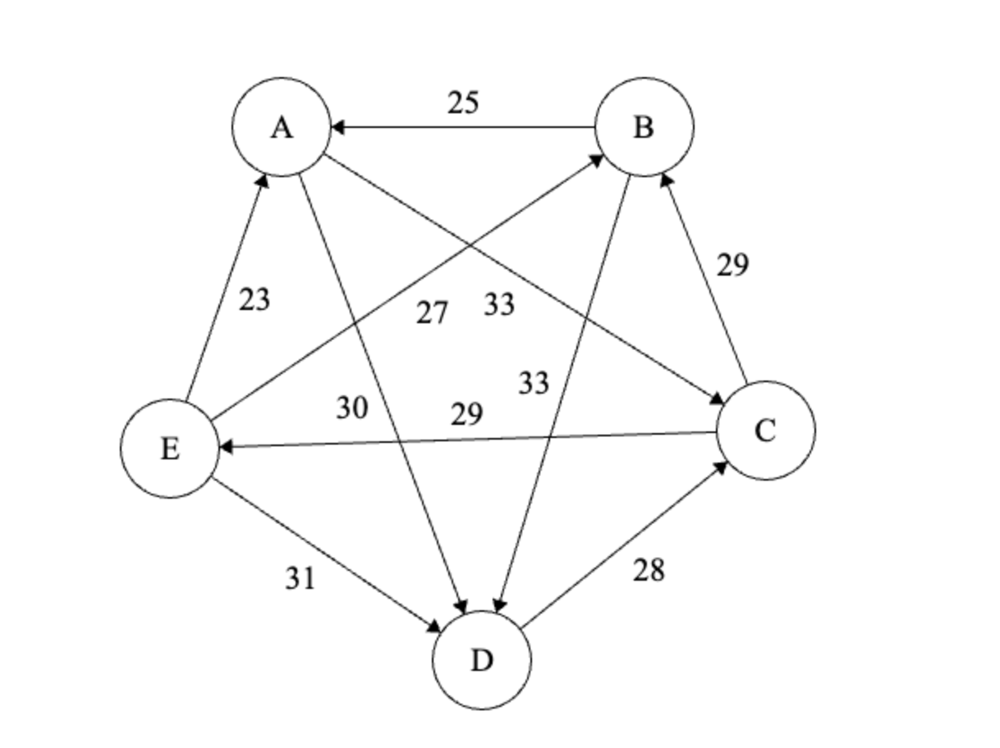

# Decisions under Ignorance

## Monkfish

**Example: Monkfish dinner.** A person is presented with two choices for food: either:

- $a_1$ : Monkfish
- $a_2$ : Hamburger
- $a_3$ : No main course

There are also two chefs.

|Option|Good chef| Bad chef |
|-|---------|----------|
|$a_1$|Good dinner | Terrible dinner|
|$a_2$| OK | OK|
|$a_3$|Hungry | Hungry|

Now we would like to rank these options, instead of using word descriptions.

|Option|Good chef| Bad chef |
|-|---------|----------|
|$a_1$|4 | 1|
|$a_2$| 3| 3|
|$a_3$|2 | 2|

We don't have any information on the probabilities about which chef she will get. It cannot be assumed that it is $50/50$. Now when an agent lacks information, they are making a decision under ignorance (sometimes called a decision under uncertainty).

However, we can still make some decisions. We can begin with pairwise comparisons. If we compare $a_1$ and $a_2$, nothing can be concluded. The same is true for $a_1$ and $a_3$. However, comparing between $a_2$ and $a_3$ tells us that $a_2$ is strictly better than $a_3$. Therefore, even without all the information, we can say that $a_2$ strictly Pareto-dominates $a_3$.

We call the dinner options "**acts**", as in the act that the agent chooses, and the chef possibilities "**states**", as in the state of the world. A pair of an act and a state maps to an **outcome**.

| |$s_1$|$ s_2$ |
|-|---------|----------|
|$a_1$|$O_{11}$ | $O_{12}$|
|$a_2$|$O_{21}$ | $O_{22}$|
|$a_3$|$O_{31}$ | $O_{32}$|

Where $O_{ij}=v(a_i, s_j)$. ($v$ is a function that produces the numerical value)

Now we can say that an act $a_i$ weakly dominates act $a_j$ if and only if $v(a_i, s) \geq v(a_j, s)$ for EVERY state $s$. (This requires at least an ordinal scale).

If we are to define strict dominance, we have the added condition that $v(a_i, s) > v(a_j, s)$ for at least one state $s$.

### The Maximin Principle

Compare the minimal values/worst outcomes  provided by each act, then choose an act whose min/worst is the maximal one among the minimums.

In other words, MAXIMIZE the MINIMUMS.

This principle can be more accurately described as:

$$a_i \succcurlyeq a_j \leftrightarrow \min(a_i) \geq \min(a_j)$$

This principle only requires an ordinal scale! (No difference or ratio needed)

However, there is an issue with ties. Consider the following specification:

| |$s_1$|$s_2$|
|-|-----|----|
|$a_1$|$1|$1000000|
|$a_2$|$1|$2|

This principle does not prefer the strictly better choice, $a_1$. It is indifferent! So we find that the general problem with this principle is that it is too pessimistic (only focuses on the worst case). This principle may be suitable for when we cannot afford risk.

---

#### Lexical Maximin

Designed specifically to break ties. If the worst outcomes are equal, we can choose an act such that the second worst outcome is certain to be as good as possible. Then if that's a tie, go for the third, etc.

If an act has several of the same outcome in different states, then we consider them all at once. For example, if we have the act

| |$s_1$|$s_2$|$s_3$|$s_4$|
|-|-----|----|-|-|
|$a_1$|$1|$3|$1|$4|

Then the first minimum is $1. Then the next is $3, and the third minimum is $4. We do NOT count $1 twice.

We can state this principle as:

$$
\begin{align*}
a_i \succ a_j &\leftrightarrow \text{there exists some positive integer } n \text{ such that } \\
{\min}^{n}{a_i} &> {\min}^{n}{a_j} \text{ and } \\
{\min}^{m}{a_i} &= {\min}^{m}{a_j} \text { for all } m < n
\end{align*}
$$

where $\min^n$ represents the $n^{th}$ minimum.

### The Maximax Principle

Choose the best of the best! We maximize the POTENTIAL!! 🤑🤑🤑💰💰🤑💵🤑

Contrary to the Minimax principle, it can be criticized for being too optimistic! It may be applicable in situations where no serious risk is involved.

### The Optimism-Pessimism Principle (The $\alpha$-index rule)

We consider both the worst and best possible outcomes for each act, according to one's own degree of optimism.

We choose some $\alpha$ between $0$ and $1$ to represent our degree of optimism. If $\alpha = 0$, we are totally pessimistic, meaning we operate identically to the minimax principle. Similarly, if $\alpha = 1$, we are completely optimistic and we operate identically to the maximax principle.

Now if $\max(a_i)$ is the best possible outcome for act $a_i$, and $\min(a_i)$ is the worst possible outcome for act $a_i$, then the value to be maximized is

$$\alpha\cdot\max(a_i) + (1 - \alpha)\cdot\min(a_i).$$

We can object to this principle in that we ignore all the intermediate values, and only use the min and max.

This principle requires an interval scale since we are taking weighted averages.

### The Minimax Regret Principle

Consider the following scenario:

| |$s_1$|$s_2$|
|-|-|-|
|$a_1$|$1.50|$1.75|
|$a_2$|$1|$10000|

What if we choose act $a_1$ and it turns out that $s_2$ is true? Then we miss out on $\$10000-\$1.75=\$9998.25$. Let's call the amount of missed opportunity for an act in a state the **regret** for that act and state. So each cell has a regret value. The regret value is always maximized; we compare it to the largest entry in the same column. If we chose the best option, then the regret is $0$.

We can actually construct a **regret table**:

| regret |$s_1$|$s_2$|
|-|-|-|
|$a_1$|$0|$9998.25|
|$a_2$|$0.50|$0|

Then the max regret for act $a_1$ (highest regret value in a cell in that row) is $\$9998.25$, while the max regret for $a_2$ is $\$0.50$. Finally, we should minimize the regret, so we should choose $a_2$.

## BELOW IS FEB 6TH

There are a lot of rules that we can use. Now we will decide which rules are good to keep.

First, we will eliminate the **Principle of insufficient reason**. We argue that there is simply insufficient justification to assume that each state has the same probability.

It is also vulernable to manipulation in areas such as politics or marketing. Maybe you want to cover some opinion up, because you don't agree with it. You could proliferate several other opinions to "drown out" the one, reducing its weight.

Next, let's talk about the **Majority rule**. There is the issue that it may lead to non-rational/intransitive group preference. For this reason, we also eliminate it.

### The Mixture Condition/Randomization Condition, Optimism-Pessimism rule

If a rational agent is indifferent between two acts, then the agent must also be indifferent between them and the $3^{\text{rd}}$ act of flipping a (fair) coin, and then choosing act 1 on heads and act 2 on tails.

Now we claim that the Optimism-Pessimism rule is incompatible with the Randomization Condition. We will prove this by providing a counterexample.

Take the following decision matrix for example:

| |$s_1$|$s_2$|
|-|-----|----|
|$a_1$|1|0|
|$a_2$|0|1|

Given any $0\leq\alpha\leq1$, then we have

$$U(a_1)=\alpha\max(a_1)+(1-\alpha)\min(a_1)$$
$$U(a_1)=1\cdot\alpha+0\cdot(1-\alpha)$$
$$U(a_1)=\alpha$$

And we follow the same reasoning to find that $U(a_2)=\alpha$ as well. Then according to the Optimism-Pessimism rule, the agent should be indifferent between the two acts.

Now let's introduce a third (randomized) act:

| |$s_1$|$s_2$|
|-|-----|----|
|$a_1$|1|0|
|$a_2$|0|1|
|$a_3$|0.5|0.5|

Now it is clear that $U(a_3)=0.5$, so as long as $\alpha\neq 0.5$, it is not true that $a_1$ is equally preferred as $a_3$. So the Optimism-Pessimism rule is not compatible with the Randomization Condition.

### The Irrelevant Expansion/Alternatives Condition, Regret rule

The addition of a new act, which is NOT regarded as better than the original ones, should not change a rational agent's ranking of the original acts.

Now we will show that the minimax regret rule is incompatible with this condition.

Consider the following decision matrix:

| |$s_1$|$s_2$|$s_3$|
|-|-----|----|--|
|$a_1$|0|10|4|
|$a_2$|5|2|10|

The minimax regret rule prescribes $a_1$. Now we add a third act:

| |$s_1$|$s_2$|$s_3$|
|-|-----|----|--|
|$a_1$|0|10|4|
|$a_2$|5|2|10|
|$a_2$|10|5|1|

And now the minimax regret rule prescribes $a_2$. So we can construct a counterexample to show that the minimax regret rule is incompatible with the irrelevant expansion condition.

We should note that the minimax regret rule seeks to MINIMIZE the MAXIMUM risk. In real-life applications, it is often extremely expensive/difficult to minimize risk. We could include some irrelevant state to our world, e.g. the state where an asteroid strikes earth. According to the minimax regret rule, we should probably build a shield or a big warhead or something to protect us from this asteroid. But it is probably better to consider other risks first, since the chances that an asteroid hits earth is very low.

Also, we tend to neglect smaller risks that are extremely likely to happen, as they are overshadowed by the big risks.

The minimax regret rule is not all bad. After 9/11, people got scared of flying, and to minimize the risk of being hijacked, decided on closer locations for vacations rather than Hawaii, for example.

### Maximax rule

This rule doesn't take risk into account at all, and thus is often considered a weak rule. However, there are situations where it could be useful, like when you have very little/nothing to lose. A small company has little to risk over a bold or controversial advertisement, whereas a large company cannot afford this risk.

Also, optimism as a personality trait is usually considered attractive?? (idk korolev just said this and didn't elaborate)

Maybe there's a hockey game where a team is behind by a couple goals and time is ticking. If the team does not take a risk, they will lose anyways, no matter how many goals are scored on them. So, it is advisable for this team to risk it all and try and tie/win the game.

### The Schulze Method

Developed in 1977 by some guy whose last name was Schulze. We didn't like the Majority rule earlier for the reason that it may yield intransitive results. This rule is also democratic, but will yield transitive results. This is adapted for use in certain electoral processes.

Consider a voting ballot, where there are five candidates: $A,B,C,D,E$. You are asked to cast a vote on this ballot. Instead of choosing one out of the five, you are asked to **order** the candidates in order of preference, one to five.

**Step 0.** We collect the votes. Suppose $45$ people voted in total. Then we construct a table where we map each ordering to the number of people who voted with that ordering:

|# of people who voted| Order of preference |
|-|-|
|5|ACBED|
|5|ADECB|
|8|BEDAC|
|3|CABED|
|7|CAEBD|
|2|CBADE|
|7|DCEBA|
|8|EBADC|

The list need not be exhaustive, as long as the numbers add up to the total.

**Step 1.** Now we need to compute pairwise preferences in a table.

How many people prefer candidate $\text{A}$ over candidate $\text{B}$? We can add up the # of people who votes in each column that have $\text{A}$ before $\text{B}$. We will find that the number is 20. So in the cell in row $\text{A}$, column $\text{B}$, we write 20.

Note that the cell in row $\text{B}$, column $\text{A}$ is different, since it represents the number of people who prefer $\text{B}$ over $\text{A}$. In total, they should add up to 45 (and they do!).

The rest of the table is filled out for brevity.

||$\text{A}$|$\text{B}$|C|D|E|
|-|-|-|-|-|-|
|$\text{A}$|x|20|26|30|22|
|$\text{B}$|25|x|16|33|18|
|C|19|29|x|17|24|
|D|15|12|28|x|14|
|E|23|27|21|31|x|

**Step 2.** Now it's time to draw a directed graph! Between any two candidates, we draw an arrow from the candidate that is more preferred to the candidate that is less preferred. In the case of $\text{A}$ and $\text{B}$, the arrow would be drawn from $\text{B}$ to $\text{A}$.

On the arrow, we write the number of people who prefer the dominant candidate over the submissive candidate. In the case of $\text{B}$ $\rightarrow$ $\text{A}$, we would have a $25$ on the arrow.

**Step 3.** Now we need to consider the **strongest path strengths**. Essentially, we are looking for the maximin. The strength of a path is the strength of its weakest link. Let's take $\text{A}\rightarrow \text{B}$ in the above example. We can go from $\text{A}$ to $\text{B}$ in four different ways: $ACB, ACEB, ADCB, \text{ and } ADCEB$. We will compute each path's strength, and find that out of all of them, $ADCB$ has the highest strength at $28$.

Now in another table of the strongest strengths, we will record in the cell in row $A$ and column $B$ that the strongest strength is $28$.

||$\text{A}$|$\text{B}$|C|D|E|
|-|-|-|-|-|-|
|$\text{A}$|x|28|28|30|24|
|$\text{B}$|25|x|28|33|24|
|C|25|29|x|29|24|
|D|25|28|28|x|24|
|E|25|28|28|31|x|

Now we can interpret this table by comparing AB to BA.

### The Condorcet Paradox

Imagine three family members choosing a place to eat dinner. In the family, we have the dad, the mom, and the child. There are some options as to where they will eat. Each member has a "preference" as to where to eat, represented in this table.

||mom|dad|child|
|-|-|-|-|
|DQ|3|1|2|
|White Spot|2|3|1|
|A&W|1|2|3|

Now you might notice that it would be kind of difficult to make a decision. Let's try to use the majority rule, using pairwise comparisons:

DQ vs White Spot: Mom and Child vote for DQ. So $\text{DQ} \succ \text{White Spot}$.

Following a similar process, we find that the group will prefer White Spot over A&W. So $\text{White Spot} \succ \text{A\&W}$.

If we do the last comparison, we will find that

$$\text{DQ} \succ \text{White Spot} \succ \text {A\&W}\succ \text{DQ}.$$

Wait a second... this ain't right! It's non-transitive!

The moral of the story: even when everyone is a rational agent, majority rule can lead into an irrational consensus decision.

## Voting systems

We can ask some American if they would prefer Joe Biden or Donald Trump as president. This is how the electoral system works! But there is an issue in that we don't consider *how strongly* one is preferred over the other. Therefore, the final result also does not reflect this.

We have two major problems:

1. The ranking problem (How to turn individual rankings into group decisions).
2. The Condorcet problem (This problem arises when a ranking is non-transitive).

**Objectives:** Firstly, do we seek the best possible functioning/effective governments with strong leadership, vision/strategic vision, that probably makes some unpopular decisions OR a system that mirrors our own desires/hopes, not excluding anyone, so that it properly reflects the whole spectrum of views of the voters?

We will see that different voting schemes favour one or the other.

### Winner-take-all elections

We count each vote and whoever gets the most votes wins it all!

There are issues with this system.

- It will leave a potentially large amount of voters without any further influence. Once the president has be elected, up to half the country would be neglected.
- The minority loses all its influence.
- It penalizes minority views
- It could also potentially penalize majority views! For example, over 70% of the population wants Trudeau to step down, but this election style allows him to remain as prime minister.

This system favours the first vision. It makes it easier for the government to pursue its objectives. However, it also makes it easier for dictatorships to arise. It doesn't provide enough checks to guard against bad decisions.

### All-Inclusive elections

This system favours the second vision.

- No one's views are neglected
- Each view is represented proportionally to their voting strengths
- Typically work well in very stable/unchanging societies
- But, in socities that are strongly divided, it yields highly ineffective systems. This can cause paralysis.

### Lewis Carroll

This was a guy. He was choosing a student for some honor. There are four candidates left for this honor, $A,B,C,D$, and there are 11 electors to choose which student gets the award.

Let's say each elector gets to rank each of the four candidates. We will end up with a $11\times 4$ table:

||1|2|3|4|5|6|7|8|9|10|11|
|-|-|-|-|-|-|-|-|-|-|-|-|
|Best|A|A|A|B|B|B|B|C|C|C|D|
|Second|C|C|C|A|A|A|A|A|A|A|A|
|Third|D|D|D|C|C|C|C|D|D|D|C|
|Fourth|B|B|B|D|D|D|D|B|B|B|B|

The first method we might use with this table is a majority vote. We see that candidate $B$ gets four votes, which is more than any other candidate. Therefore, we will choose candidate $B$.

What are some criticisms of this method? We might notice that every elector that didn't choose $B$ as the first candidate placed them last instead.

### More voting scheme stuff

Consider the preference of nine voters:

||2 voters|3 voters|4 voters|
|-|-|-|-|
|1st choice|A|B|C|
|2nd choice|B|A|A|
|3rd choice|C|C|B|

By the majority rule, then C would be elected, but only $4/9$ of the population actually wanted him! A minority is being represented.

### Weighted voting

Borda's scheme assigns "points" to each preference. For example, maybe the first choice gets 2 points, the second choice gets one point, and the last choice gets none. If we add up everything now, we will find that A wins, with 11 points versus B and C both with 8 points.

### Preferential voting

Okay, what about preferential voting? We have two stages: the first is to see if there is a majority. If over 50% vote for one candidate then so be it, they are the majority.

Otherwise we eliminate the worst candidate and their 2nd place votes go to the remaining candidate. Note that this does not require a "re-voting", we just need to re-analyze the votes.

In the context of our example, A is the worst candidate by majority, only looking at 1st preference. So A is eliminated. Then the two voters who voted for A will have their vote transferred to B. Therefore, B has 5 voters against C's 4, and wins by majority.

### Runoff elections

Similar to preferential voting. If we have a majority then they win by default. Otherwise, we will hold a second round of elections, separated by some time (around a month). In this election, we elect among the leading two candidates. The time difference allows for things to change according to shifting views!

## Kenneth Arrow's Impossibility Theorem

There is NO way to come up with a unified group-decision rule for diverse, multiparty, multicriterion decisions based on rankings provided some certain requirements are placed.

The requirements:

- If the individuals ALL agree, then so should the group. (Unanimous decisions should be respected)
- If after the individual rankings have been used to create the group ranking, and you then add new options, the previously determined options should NOT change. This also holds for removal of options.
- If the group ranking ends up preferring A over B, and we add another voter who also prefers A over B, the group ranking should not change.

Now there is actually one exception to this rule: if we give all of the authority to only ONE decision maker, then all the requirements can be met.

## More applications to Social Philosophy

Strong (weak) Pareto-Dominance in a society:

Let $P$ be a set of members of society.

For each person $p\in\mathbb{P}$, let $\succ_p$ ($\succeq_p$) be a rational preference ordering among a set of options $O$, and let $u_p$ be the utility function for person $p$.

**Definition.**

An option $X$ strongly Pareto-dominates another option $Y$ if and only if for all $p\in\mathbb{P}$, $u_p(X)>u_p(Y)$.

An option $X$ weakly Pareto-dominates another option $Y$ if and only if for all $p\in\mathbb{P}$, $u_p(X)\geq u_p(Y)$, and for some $p$, $u_p(X)>u_p(Y)$.

### John Rawls' Theory of Justice

Rawls' 2nd Principle of Justice:

- An unequal distribution of resources is *just* if and only if it strongly Pareto-dominates all equal distributions;
- An equal distribution of resources will be considered *just* if and only if there exists no other distribution, equal or unequal, that strongly Pareto-dominates it.

Less formally, one society is better (more just) than another iff the worst-off members of the first society do better than the worst-off members of the second society.

Obviously, this comes with issues. Notably, it inherits all of the issues with the maximin principle!

Let's think about a scenario where three people want a spot. Here is a table that describes this scenario:

||Maite|Christa|Oliver|
|-|-|-|-|
|Nobody gets the spot (a1)|0|0|0|
|Maite gets the spot (a2)|1|0|0|
|Christa gets the spot (a3)|0|1|0|
|Oliver gets the spot (a4)|0|0|1|
|The spot is shared (a5)|1/3|1/3|1/3|
|Maite preferred sharing (a6)|2/3|1/6|1/6|

The only distributions that are equal are the first and the second-to-last. Every other row is unequal.

a5 strongly dominates a1, so we can conclude that a1 is not just.

We may also notice that no distribution strongly Pareto-dominates a5. Then by Rawls' 2nd Principle of Justice, we can say that a5 is just. No other distributions will be considered just, since they do not strongly dominate all equal distributions.

### John Harsanyi's Theory of Justice

Crucial point: Which rule should be chosen by a society for making decisions under ignorance?

Rawls used the maximin, aiming to protect the interests of those at the bottom of society.

But Harsanyi chooses the principle of Insufficient Reason, choosing to prioritize the average level of well-being in a society. This is an example of utilitarianism.

The issue with taking the average is that a society with a massive divide in wealth will still have a high average thanks to the rich people, which is not representative of the whole society. Therefore, we might choose to use the median instead, which reflects this divide better.